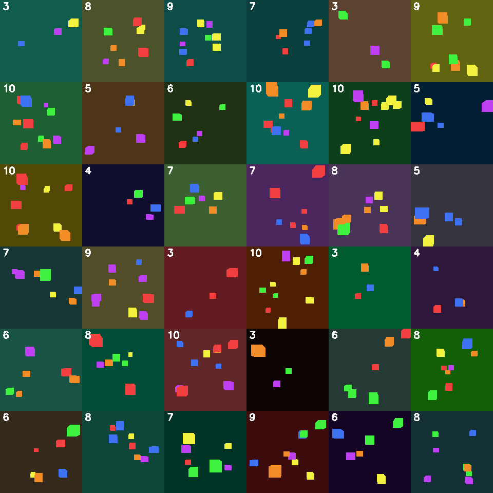
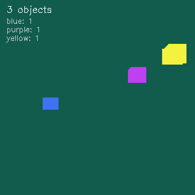

# tinygl-synth

**Fast CPU renderer for synthetic training data generation.** No GPU required.




tinygl-synth is a lightweight 3D renderer designed for generating synthetic training data for machine learning. It runs entirely on CPU and produces:

- **RGB images** - rendered scenes
- **Depth maps** - per-pixel depth values  
- **Segmentation masks** - per-object instance IDs
- **Surface normals** - for 3D understanding

**Speed:** ~2500 samples/second on a typical CPU.

## Why Use This?

| Problem | tinygl-synth Solution |
|---------|----------------------|
| Labeling data is expensive | Ground truth is FREE - we generate it! |
| Need GPU for rendering | Runs on CPU, anywhere |
| Complex dependencies | Zero external dependencies (C library) |
| Slow iteration | Generate -> train -> iterate in seconds |

## Key Demo: Spatial Reasoning Dataset

Generate training data for Visual Question Answering:

```bash
python examples/demo_spatial_reasoning.py
```

**Output:** 5000 scenes with 50,000 QA pairs in ~3 seconds!

Example questions automatically generated:
- "How many red objects?" -> 2
- "Which color is highest?" -> yellow  
- "Are there more blue than green?" -> no



## Quick Start

### 1. Build the C library

```bash
mkdir build && cd build
cmake ..
cmake --build . --config Release
cd ..
```

On Windows, build rules copy `tinygl_synth.dll` next to example/test executables automatically.

### 2. Install Python bindings

```bash
cd python
pip install -e .
pip install imageio opencv-python  # For demos
cd ..
```

**Note:** The `-e` flag installs in "editable" mode - changes to Python code take effect immediately.

### 3. Verify installation

```bash
python examples/verify_qa.py
```

This creates `samples/verify_qa_grid.png` with labeled images you can manually verify.

### 4. Run demos

```bash
python examples/demo_spatial_reasoning.py   
python examples/demo_spin_cube.py           # Multi-modal output
python examples/demo_speed_test.py          # Speed benchmark
```

## Python API

```python
from tinygl_synth import Context

# Create 256x256 rendering context
ctx = Context(256, 256)

# Clear with background color
ctx.clear(50, 50, 60, 1.0)

# Set camera (fov, near, far, view_matrix)
ctx.set_camera(60.0, 0.1, 10.0, view_matrix)

# Add colored mesh
ctx.add_mesh_colored(vertices, indices, object_id=1)

# Render
ctx.render()

# Get outputs (numpy arrays)
rgb = ctx.rgb_tensor()        # (H, W, 3) uint8
depth = ctx.depth_tensor()    # (H, W) float32
seg = ctx.segmentation_tensor()  # (H, W) uint32
```

## Examples

| Example | Description |
|---------|-------------|
| `demo_spatial_reasoning.py` | Generate VQA training data with automatic labels |
| `demo_speed_test.py` | Speed benchmark - colorful orbiting cubes |
| `demo_spin_cube.py` | Simple spinning cube with multi-modal output |
| `pose_estimation_demo.py` | Train pose estimator on synthetic data |
| `train_pytorch_policy.py` | Full PyTorch training pipeline |

## Sample Outputs

Located in `samples/`:

| File | Description |
|------|-------------|
| `spatial_reasoning_grid.png` | 36 scenes with varying object counts |
| `spatial_reasoning_demo.gif` | Animated scenes with labels |
| `speed_test.gif` | High-FPS colorful rendering |
| `pose_estimation_demo.png` | Sub-degree pose accuracy |
| `multimodal_output.gif` | RGB + Depth + Segmentation |

## Performance

On Intel i7 (single-threaded):
- **2500+ samples/sec** at 128×128
- **700+ samples/sec** at 256×256
- **120+ FPS** for animated demos

## Use Cases

1. **VLM Training Data** - Spatial reasoning, counting, relationships
2. **Object Detection** - Synthetic pretraining with perfect labels
3. **Depth Estimation** - RGB→Depth with free ground truth
4. **Pose Estimation** - 6DoF object pose from synthetic scenes
5. **RL Environments** - Fast vision-based observations

## C API

```c
#include <tinygl_synth/synth.h>

TGLSynthContext* ctx = tgls_create_context(256, 256);
tgls_clear(ctx, 50, 50, 60, 1.0f);
tgls_set_camera(ctx, fov, near, far, view_matrix);
tgls_add_mesh(ctx, vertices, n_verts, indices, n_indices, object_id);
tgls_render(ctx);

uint8_t* rgb = tgls_get_rgb_buffer(ctx);
float* depth = tgls_get_depth_buffer(ctx);
uint32_t* seg = tgls_get_segmentation_buffer(ctx);
tgls_destroy_context(ctx);
```

## Platform Support

- Windows: supported and tested (`MSVC` + CMake).
- Linux/macOS: source code and CMake support both (`.so`/`.dylib` naming handled in Python loader), but CI is not set up yet.

## Project Structure

```
tinygl-synth/
├── src/           # C source code
├── include/       # C headers
├── python/        # Python bindings
├── examples/      # Demo scripts
├── samples/       # Output showcase
└── tests/         # C tests
```

## License

MIT License - see [LICENSE](LICENSE)
