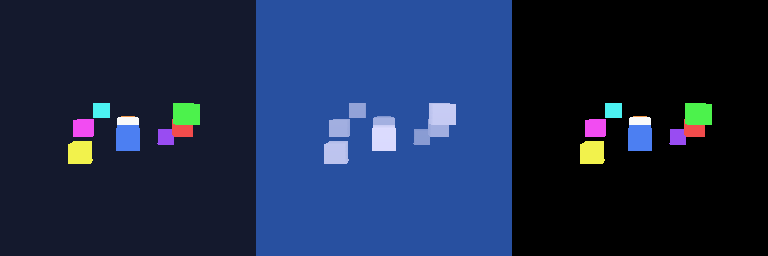

# Sample Outputs

These are showcase outputs generated by tinygl-synth demos.

## Spatial Reasoning 


**5000 scenes × 10 QA pairs = 50,000 training examples in 3 seconds!**

Questions like:
- "How many red objects?" -> 2
- "Which color is highest?" -> yellow
- "More blue than green?" -> no

## Speed Test Demo



120 frames rendered at ~120 FPS on CPU.

## Multi-Modal Output


RGB | Depth | Segmentation from a single render.

## Other Demos

| File | Description |
|------|-------------|
| `pose_estimation_demo.png` | Sub-degree pose accuracy |
| `wow_orbit_demo.gif` | Colorful orbiting cubes |
| `spin_cube.gif` | Classic spinning cube |

## Regenerate These

```bash
python examples/demo_spatial_reasoning.py
python examples/demo_speed_test.py
python examples/demo_spin_cube.py
```
